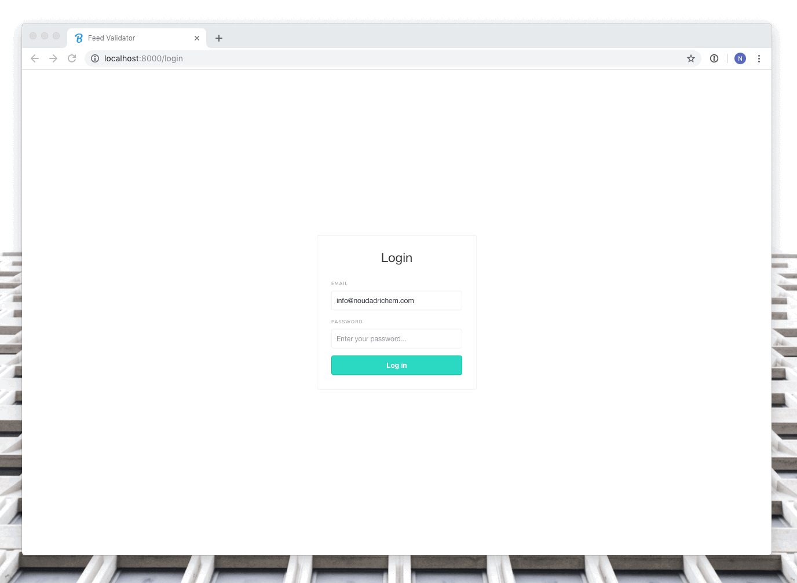

# 🔍👨🏻‍💻️ Dynamic Feed Validator (School Assignment)

Validates Google Merchant product feeds by streaming XML RSS feeds via Java and push notifications to an Angular front-end via WebSockets.


> _Assignment made as propedeuse assesement at Hogeschool Utrecht 2019, this project is not related to Bannerwise and is fully isolated from the Bannerwise platform._

## Demo:
https://bw-dynamic-feed-validator.herokuapp.com/upload

## Test links: 
- https://werk.noudadrichem.com/feed-validator/benchy-bad-feed.xml
- https://werk.noudadrichem.com/feed-validator/benchy-good-feed.xml
- https://werk.noudadrichem.com/feed-validator/batterijland-bad-feed.xml 


## Stack that is used:
- Java EE
- Jersey
- Tomcat
- Angular 7.2
- PostgreSQL


## API endpoints:
#### upload [POST]
/api/xmlservice/upload
```json
{
  "url": "xml feed url"
}
```

#### Feeds from  user (pseudo user) [GET] 
/api/feed/all

#### Single feed from  user (pseudo user) [GET] 
/api/feed/[FEED_ID]

#### Messages from feed from user (pseudo user) [GET]
/api/message/all/[FEED_ID]

### Socket URL: [ws://]
ws://HOST/socket


### See Heroku logs:
```bash
heroku logs --tail -a bw-dynamic-feed-validator
```

### test rest servlet: 
/webapp/api/ping
